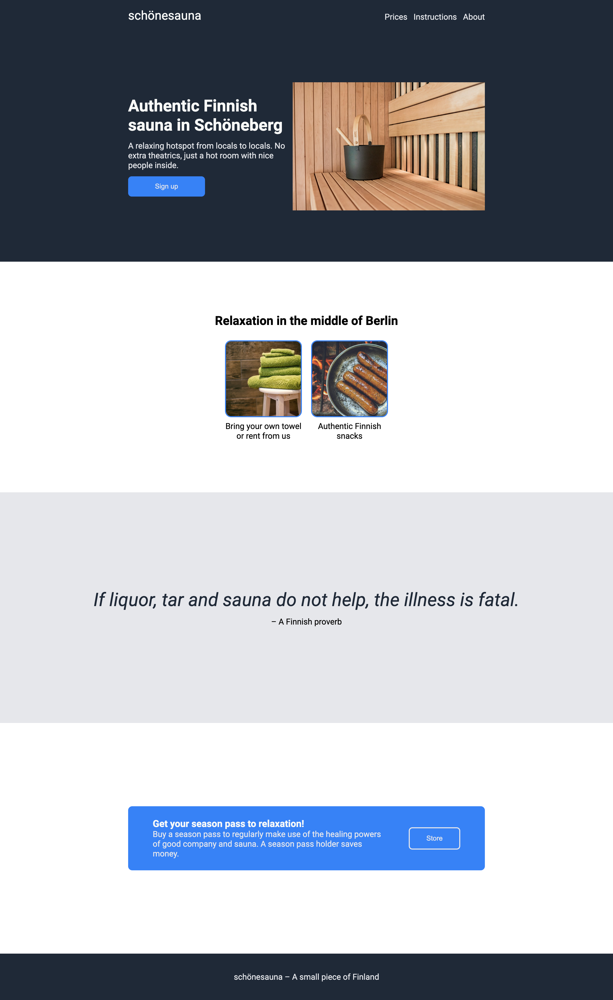

# Sauna website
This was the final project of HTML and CSS foundations where I created an un-responsive sauna website. The main goal was to make it look good, functionality is something we'll learn later. Underneath is a picture of the website I created based on the "goal.png" picture.

